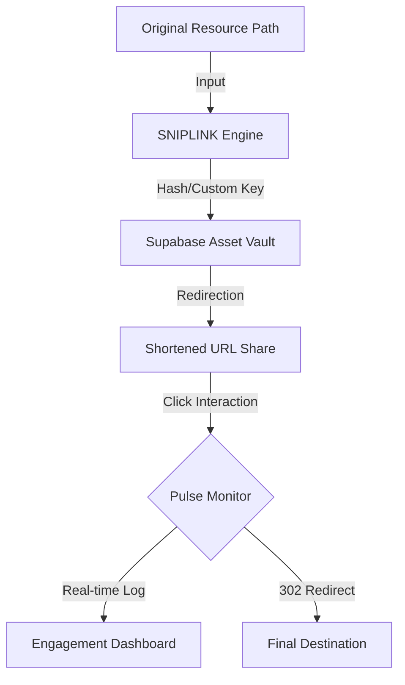

# ✂️ SNIPLINK — High-Fidelity URL Archival & Analytics Suite

SNIPLINK is a professional-grade, obsidian-inspired URL management system built for precision, elegance, and deep analytics. Developed as a high-end alternative to generic link shorteners, it treats each link as a curated digital asset.

---

## 🚀 The Core Logic: How It Works

SNIPLINK operates on a **Proprietary Proxy-Redirection Engine**. Here is the high-level logic that powers the archival:

### 1. The Archival Handshake
When you submit a long URL, the system performs a **Collision-Resistant Slug Generation**. It hashes your URL (or uses your custom proxy key) to create a unique identifier in the Supabase PostgreSQL vault.

### 2. The Pulse Interception
Every time a user visits your shortened link:
- **Phase A (Capture)**: The Edge Function/Frontend interceptor identifies the unique slug.
- **Phase B (Logging)**: A real-time `click_log` entry is created, capturing the timestamp.
- **Phase C (Redirection)**: The server performs a `302 Temporary Redirect` to the destination URL stored in the vault.

### 3. Analytics Synthesis (The "Answer Logic")
The dashboard doesn't just show clicks; it performs an **In-Memory Time-Series Aggregation**:
- It groups clicks by your selected window (24H Pulse, 7D, 14D, etc.).
- It calculates the **Retention Velocity** to determine if your link is gaining momentum or decaying.

---

## 📈 Visualizing the link lifecycle

---

## 📈 Metric Dictionary (Simple Terms)

| Metric | Scientific Logic | In Simple Words |
| :--- | :--- | :--- |
| **Impressions** | $\sum C$ (Sum of Total Click Logs) | Total clicks you've gained. |
| **Retention Velocity** | $\frac{\Delta C}{\Delta T}$ (Rate of popularity change) | Is your link trending up or down? |
| **Archival Pulse** | $C_{last24h}$ (Last 24H aggregated) | How your link performed today, hour-by-hour. |
| **Asset Age** | $T_{now} - T_{created}$ | How long your link has been protected. |

---

## 🎨 Design Identity: "Obsidian Edition"

This suite is built with a premium, editorial-first aesthetic:
- **Typography**: Paired **Syne** (Bold Headlines) and **Sora** (Surgical Body Text).
- **Interface**: Deep-space obsidian dark mode with glassmorphic cards.
- **Micro-Animations**: Kinetic buttons and high-fidelity Rechart transitions.

---

## 👤 Lead Architect

Developed and maintained by **Tushar Jain**.

- **Portfolio**: [tusharjain.in](https://tusharjain.in)
- **Email**: [jaint0910@gmail.com](mailto:jaint0910@gmail.com)
- **Vision**: Creating software that is as beautiful as it is functional.

---

## 🔧 Deployment Guide

1. **Clone**: `git clone https://github.com/Tusharjain-19/url-shortener.git`
2. **Install**: `npm install`
3. **Configure**: Set up `VITE_SUPABASE_URL` and `VITE_SUPABASE_ANON_KEY` in `.env`.
4. **Launch**: `npm run dev`

---

&copy; 2026 SNIPLINK. Built with passion by **Tushar Jain**.
