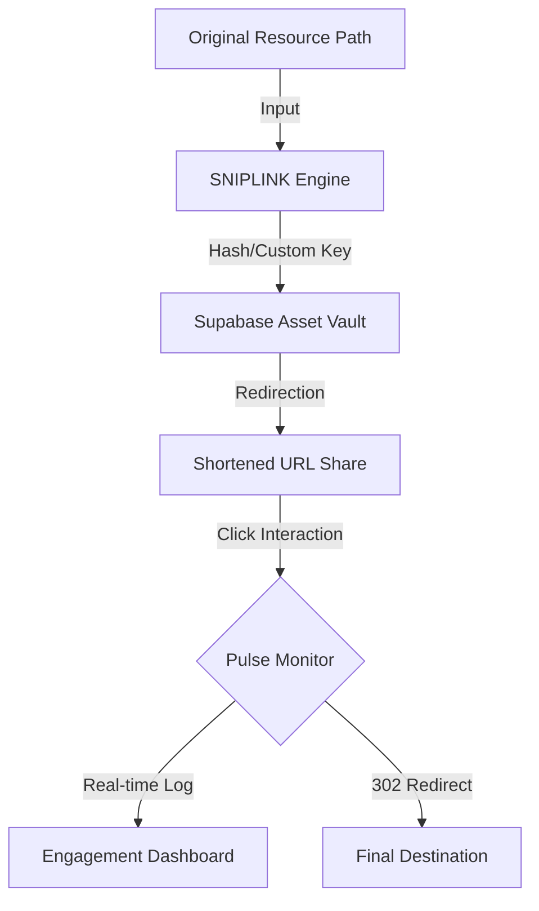

# ✂️ SNIPLINK — High-Fidelity URL Archival & Analytics Suite

SNIPLINK is a professional-grade, obsidian-inspired URL management system built for precision, elegance, and deep analytics. Developed as a high-end alternative to generic link shorteners, it treats each link as a curated digital asset.

---

## 🇮🇳 Samajhie SNIPLINK Kaise Kaam Karta Hai? (Hinglish Guide)

Chaliye simple words mein samajhte hain ki yeh system kaam kaise karta hai:

1. **The Input (Aapka Link)**: Sabse pehle aap apna bada aur complex Link (e.g., Google Drive ya Portfolio) box mein paste karte hain.
2. **The Transformation (Shortening Logic)**: Hamara system us link ko ek unique aur Chota "Proxy Key" deta hai (e.g., `snip.ly/RE9RUB`). Yeh key hamare **Supabase Database** mein safe ho jati hai.
3. **The Interception (Click Tracking)**: Jab bhi koi us naye chote link par click karta hai, hamara system pehle us user ka "Click" detect karta hai aur usey **Real-Time** log kar leta hai. 
4. **The Redirection (Final Destination)**: Click log karne ke baad, instantly system usey uske asli (Original) link par bhej deta hai. Yeh itna fast hota hai ki user ko pata bhi nahi chalta!
5. **The Analytics (Aapka Dashboard)**: Jo clicks save hue the, unka data hum charts (Area, Line, Pie) mein convert karte hain taaki aap dekh sakein ki aapka link kitna hit hai!

---

## 🚀 The Core Logic: How It Works (Technical)

SNIPLINK operates on a **Proprietary Proxy-Redirection Engine**. Here is the high-level logic that powers the archival:

### 1. The Archival Handshake
When you submit a long URL, the system performs a **Collision-Resistant Slug Generation**. It hashes your URL (or uses your custom proxy key) to create a unique identifier in the Supabase PostgreSQL vault.

### 2. The Pulse Interception
Every time a user visits your shortened link:
- **Phase A (Capture)**: The Edge Function/Frontend interceptor identifies the unique slug.
- **Phase B (Logging)**: A real-time `click_log` entry is created, capturing the timestamp.
- **Phase C (Redirection)**: The server performs a `302 Temporary Redirect` to the destination URL stored in the vault.

### 3. Analytics Synthesis (The "Answer Logic")
The dashboard doesn't just show clicks; it performs an **In-Memory Time-Series Aggregation**:
- It groups clicks by your selected window (24H Pulse, 7D, 14D, etc.).
- It calculates the **Retention Velocity** to determine if your link is gaining momentum or decaying.

---

## 📈 Visualizing the link lifecycle

---

## 📊 Metric Dictionary

| Metric | Scientific Logic | Hindi Version |
| :--- | :--- | :--- |
| **Impressions** | $\sum C$ (Sum of Total Click Logs) | Kul kitne clicks mile. |
| **Retention Velocity** | $\frac{\Delta C}{\Delta T}$ (Rate of popularity change) | Link kitna fast fail raha hai. |
| **Pulse** | $C_{last24h}$ (Last 24H aggregated) | Aaj ka report, ghante ke hisaab se. |

---

## 🎨 Design Identity: "Obsidian Edition"

This suite is built with a premium, editorial-first aesthetic:
- **Typography**: Paired **Syne** (Bold Headlines) and **Sora** (Surgical Body Text).
- **Interface**: Deep-space obsidian dark mode with glassmorphic cards.

---

## 👤 Lead Architect

Developed and maintained by **Tushar Jain**.

- **Portfolio**: [tusharjain.in](https://tusharjain.in)
- **Email**: [jaint0910@gmail.com](mailto:jaint0910@gmail.com)
- **Vision**: Software as art.

---

&copy; 2026 SNIPLINK. Built with passion by **Tushar Jain**.
